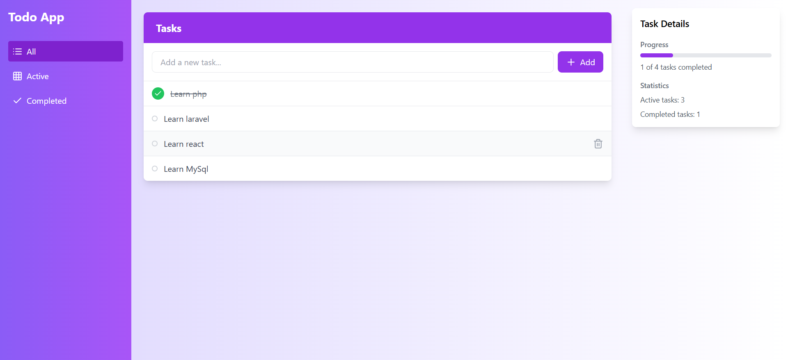
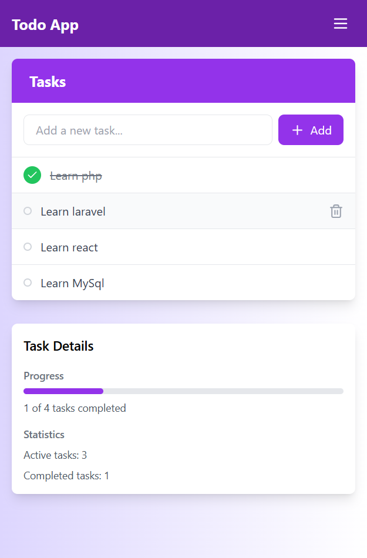

# Todo App

### Une application moderne et minimaliste pour la gestion des tâches

---

## Table des matières

- [Aperçu](#aperçu)
- [Fonctionnalités](#fonctionnalités)
- [Technologies](#technologies)
- [Déploiement](#déploiement)
- [Auteur](#auteur)

---

## Aperçu

**Todo App** est une application moderne et intuitive conçue pour organiser efficacement vos tâches quotidiennes. Avec une interface simple et élégante, cette application permet de créer, gérer et suivre vos tâches en toute simplicité. Que ce soit sur un ordinateur, une tablette ou un smartphone, **Todo App** s'adapte parfaitement à tous les écrans grâce à son design responsive.

Le projet utilise **React.js** et **Tailwind CSS** pour offrir une expérience utilisateur fluide et rapide. Il est facile à personnaliser et à intégrer dans vos propres projets.

---

## Aperçu visuel

### Desktop View

### Mobile View

---

## Fonctionnalités

- **Ajout de tâches** : Créez de nouvelles tâches avec un champ de saisie intuitif.
- **Gestion des tâches** :
  - Marquez une tâche comme terminée.
  - Supprimez les tâches non nécessaires.
- **Filtres dynamiques** : Affichez les tâches par catégorie :
  - Toutes.
  - Actives.
  - Terminées.
- **Notifications interactives** : Utilisation de **React Toastify** pour des notifications informatives (ajout, suppression, etc.).
- **Design responsive** : Optimisé pour une utilisation fluide sur tous les appareils.
- **Transitions fluides** : Animations et effets modernes pour une expérience interactive.

---

## Technologies

- **React.js** : Framework JavaScript pour construire une interface utilisateur dynamique.
- **Tailwind CSS** : Framework CSS utilitaire pour un design rapide et flexible.
- **React Toastify** : Bibliothèque pour gérer les notifications interactives.
- **NPM** : Gestionnaire de paquets pour installer les dépendances.
- **LocalStorage** : Persistance des tâches pour conserver les données même après actualisation ou fermeture de l'application.

---

## Déploiement

L'application est déployée sur [Todo App](https://github.com/Elgargati/Todo_App).

---

## Auteur

- **Mohammed El Gargati**
- GitHub : [Elgargati](https://github.com/Elgargati)

---

N'hésitez pas à me contacter si vous avez des questions ou des suggestions !
